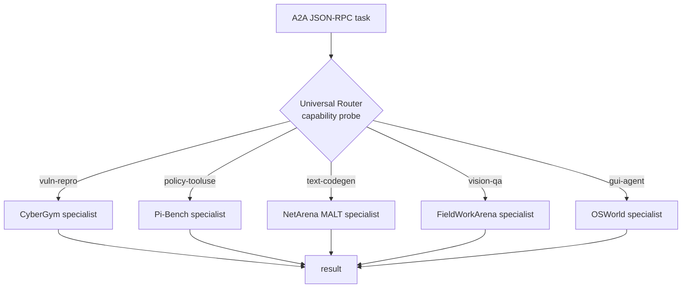

# Universal Router

**One purple agent across all five Berkeley RDI AgentBeats Phase 2 benchmark tracks.** A single Rust/[axum](https://github.com/tokio-rs/axum) routing agent, registered against every green, that inspects each incoming task, dispatches it to the right domain specialist, and returns the result — proving generality empirically rather than fielding five separate agents.

Built for the AgentBeats Phase 2 grand finale (Sprint 4): CyberGym · Pi-Bench · NetArena MALT · FieldWorkArena · OSWorld.

---

## Why a router?

Sprint 4 rewards generality — eligibility requires a purple agent registered on **5+ greens across 3+ categories**. The common approach is a bespoke agent per track. Universal Router takes the harder, more general path: the *same* agent, registered against all five greens, demonstrating that a single routing layer can span security reproduction, policy/tool-use, network configuration, vision QA, and GUI automation.

This directly addresses the four judging axes:

- **Generality** — one agent, five tracks, three+ categories.
- **Leaderboard performance** — specialist backends tuned per track (results below).
- **Cost efficiency** — static Rust binaries; one decisive high-ceiling run per track rather than repeated averaging.
- **Technical quality** — reproducible multi-stage build, digest-pinned deploy, verify-before-submit discipline.

---

## Architecture



A thin axum front door receives A2A tasks on the public port and forwards each to one of five specialist backends, selected by a **capability probe** over the task content:

| Capability     | Specialist        | Track           | Model backend |
|----------------|-------------------|-----------------|---------------|
| `vuln-repro`   | cybergym-agentx   | CyberGym        | OpenAI GPT-5.5 (primary) / GPT-5.4 (fallback) |
| `policy-tooluse` | pibench-agentx  | Pi-Bench        | OpenAI GPT-5.5 (primary) / GPT-5.4 (fallback) |
| `text-codegen` | netarena-agentx   | NetArena MALT   | Azure `gpt-5.4-mini` |
| `vision-qa`    | fwa-agentx        | FieldWorkArena  | OpenAI GPT-5.4 (primary) / GPT-5.5 (fallback), multimodal |
| `gui-agent`    | osworld-agentx    | OSWorld         | Qwen3.5 planner (Qwen2.5 fallback) + Jedi-7B grounder |

**Content-only routing.** AgentBeats purple agents receive task data but *not* a task_id, so the router fingerprints each task from its payload alone — modalities present, instruction shape, tool schema — never from an identifier or lookup. This keeps dispatch fully general and compliant with the no-hardcoded-answers rule.

---

## The five specialists

### CyberGym — vulnerability reproduction · **#1, peak score 19**
Rust A2A agent that reads target source and patches to reproduce vulnerabilities, built around root-cause patch strategies (binary-format reading, seed injection, session-state fallback, hex-dumping, format-rejection detection). A `patch_windows` mode handles large files by windowing around the patched region. Calls OpenAI directly — GPT-5.5 (primary), GPT-5.4 (fallback) — with retry-and-backoff on 429/5xx for stability under parallel load. Green scoring is on container exit codes (vuln container fails, fix container passes) under a 10-second PoC timeout.

### Pi-Bench — policy execution & tool use · **#1, 90.1%**
Compliance achieved through **pure prompt engineering** — no code-based outcome manipulation. Switching to GPT-5.5 (primary) / GPT-5.4 (fallback) drove the forbidden-attempt rate to 0%; a *no-tool-replay* instruction prevents re-calling already-executed tools, and explicit tool ordering handles AML/FINRA scenarios. Sub-scores: policy execution 93.9, policy boundaries 89.2, semantic 92.0.

### NetArena MALT — network configuration · **#1, 60% correctness / 100% safety**
`gpt-5.4-mini` via Azure. Two decisive fixes: rank outputs emitted as native `[name, float]` pairs (not stringified tuples), and the Azure model's requirement of `max_completion_tokens` rather than `max_tokens`.

### FieldWorkArena — vision QA · **#2, 149.6 / 239**
Rust multimodal A2A with sync and SSE streaming, on OpenAI GPT-5.4 (primary) / GPT-5.5 (fallback), extracting text, JPEG (via the `image` crate), PDF (`pdf-extract`), video frames (ffmpeg), and bounding-box metadata. The key accuracy lever was an answer policy of full-sentence restatement rather than terse factual replies, plus document-aware scoring for non-image envelopes. GLIBC portability handled by compiling inside a Debian-bookworm builder stage.

### OSWorld — GUI automation
A **two-model** design: a Qwen3.5-397B reasoning planner (multimodal, via DeepInfra; Qwen2.5 fallback) decides the next UI action from the screenshot, and a self-hosted **Jedi-7B-1080p** grounder (served on a GPU via vLLM) converts that action into precise screen coordinates. The planner's reasoning budget is tuned (`max_tokens` 3000) so its chain-of-thought completes and the final action lands in `content` rather than being truncated.

---

## Build & deploy

Single multi-stage Docker image assembling all five specialists. Each is a static **musl** binary — compiled in its build stage or copied pre-built from the build context (OSWorld) — for a portable, glibc-independent artifact.

```bash
docker build -t tenalirama2026/universal-router:<ver> .
docker push  tenalirama2026/universal-router:<ver>
docker buildx imagetools inspect tenalirama2026/universal-router:<ver>   # capture digest
```

Deployment is driven by **`amber-manifest.json5`** — the authoritative config, served from the repository's raw URL and pinning the image by `sha256` digest. Dockerfile `ENV` defaults are a safety net only; the manifest is source of truth.

### Verify-before-submit discipline
Stale binaries are the enemy of a multi-stage build. Before every submission:

1. `cargo clean && cargo build --release --target x86_64-unknown-linux-musl`
2. `docker build`, then **verify inside the image** — `grep` the entrypoint config and `ls -la` the binary size. Never trust the build; verify the artifact.
3. Confirm the **raw manifest digest matches the pushed image** before registering on AgentBeats.

---

## Design principles

- **Rust-first.** Every specialist is Rust/axum — static binaries, predictable performance, no runtime surprises.
- **Local validation before any cloud submission.** Nothing ships without a passing local test: container exit-code checks (CyberGym), shard scoring (Pi-Bench), 3/3 fixtures (FieldWorkArena), A2A smoke tests (OSWorld).
- **Generalizable improvements only.** Per Berkeley RDI rules, no hardcoded answers and no task-specific lookup tables. Every gain comes from reading source, parsing patches, and prompt engineering — never memorized outputs. Content-only fingerprinting enforces this at the routing layer.
- **One decisive submission.** The leaderboard takes `MAX(score_rate)`, so each track targets a single high-ceiling run rather than averaging many.

---

## Results

| Track            | Rank | Result |
|------------------|:----:|--------|
| CyberGym         | **#1** | peak score 19 |
| Pi-Bench         | **#1** | 90.1% |
| NetArena MALT    | **#1** | 60% correctness · 100% safety |
| FieldWorkArena   | **#2** | 149.6 / 239 |
| OSWorld          |  —   | Qwen3.5-397B planner + Jedi-7B grounder |

---

## Repository layout

```
universal-router/
├── Dockerfile              # multi-stage build assembling all five specialists
├── entrypoint.sh           # per-specialist runtime config (endpoints, models)
├── amber-manifest.json5    # authoritative deploy config (digest-pinned)
├── src/                    # router front door (axum, A2A, capability probe)
├── fwa-agentx-src/         # FieldWorkArena specialist source (built in-image)
└── agentx-osworld          # OSWorld specialist (pre-built static-musl binary)
```

---

*Berkeley RDI AgentBeats Phase 2 · Sprint 4. Built solo by [@tenalirama2005](https://github.com/tenalirama2005).*
